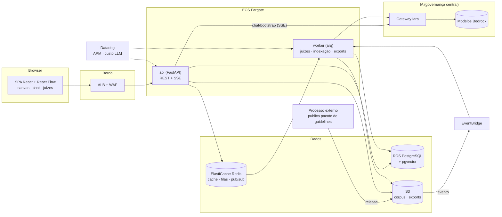

# AIrchitecture

App para criação de diagramas de System Design com simulador de carga e assistido por IA, para facilitar a vida de quem precisa desenvolver arquiteturas, simular cenários e preencher documentos de Arquitetura.

Este projeto surgiu da dor de desenvolver arquiteturas de software na cloud possuindo diversos gaps na minha formação e tento que aprender muitos conceitos enquanto desenvolvo. 
Para otimizar o meu tempo e entregar soluções melhores, comecei a criar as arquiteturas enquanto estudava usando IA, mas era um pouco moroso explicar cada conexão e nó no prompt ou fazer centenas de prints a cada nova mudança ou pergunta. Além disso os aplicativos comuns para criação de diagramas são muito ruins na minha opnião, poluidos, pesados e cheio de recursos desnecessários. Por isso decidi criar algo simples, que atenda as minhas necessidades de desenvolvimento e que integre IA nativamente.

O app propõe:

- Canvas para System Design
- Ask AI para tirar duvidas de arquitetura
- Judge-Architect - para avaliar a arquitetura criada utilizando os Guides pré-definidos
- Simulador Deterministico de carga - gargalos, latência, disponibilidade
- Pré-ADR para agilizar o processo e discussões

> Projeto completamente inspirado na ferramenta de estudo [System Design Playground](https://system-design-playground.replit.app) excelente, criado pelo [Lucas Montano](https://www.youtube.com/@LucasMontano)

## Arquitetura final (visão)

## Estágio atual

**MVP** — em construção, rodando 100% local (docker compose) e 100% mock
(nenhuma chamada real de LLM; fixtures determinísticas nos schemas de produção).
A troca para providers reais (Ollama local / gateway Iara) e o deploy AWS são
pós-validação, por configuração — nenhum módulo de feature conhece o ambiente.

➡️ **[README do MVP](mvp/README.md)** — arquitetura local, como executar e o
andamento das fases.
