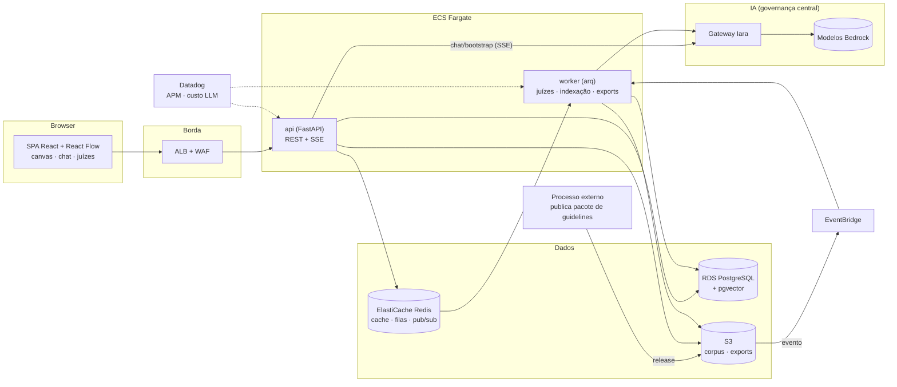

# AIrchitecture

Canvas de arquitetura de software com **IA dedicada na mesma tela**: um
playground onde engenheiros desenham suas arquiteturas (tradicionais e GenAI) e
contam, sem sair do canvas, com um **Arquiteto IA** (tira dúvidas, recomenda
padrões e propõe alterações direto no diagrama), um **Juiz IA** (avalia o
desenho contra os guidelines da empresa, com citação obrigatória de doc + seção)
e um **simulador determinístico** de carga (gargalos, latência, disponibilidade).
Ao final, a sessão vira um **pré-ADR** exportável.

## Objetivo

Validar a hipótese central: engenheiros preferem criar e validar arquiteturas em
um canvas com IA integrada — fundamentada nos guidelines corporativos via RAG —
em vez do fluxo atual (ferramenta de desenho estática + revisão humana tardia).
As specs completas, decisões de produto (D1–D17) e o blueprint end-to-end estão
em `../ADR/` e `../Implementação/`.

## Arquitetura final (visão)

## Estágio atual

**MVP** — em construção, rodando 100% local (docker compose) e 100% mock
(nenhuma chamada real de LLM; fixtures determinísticas nos schemas de produção).
A troca para providers reais (Ollama local / gateway Iara) e o deploy AWS são
pós-validação, por configuração — nenhum módulo de feature conhece o ambiente.

➡️ **[README do MVP](mvp/README.md)** — arquitetura local, como executar e o
andamento das fases.
