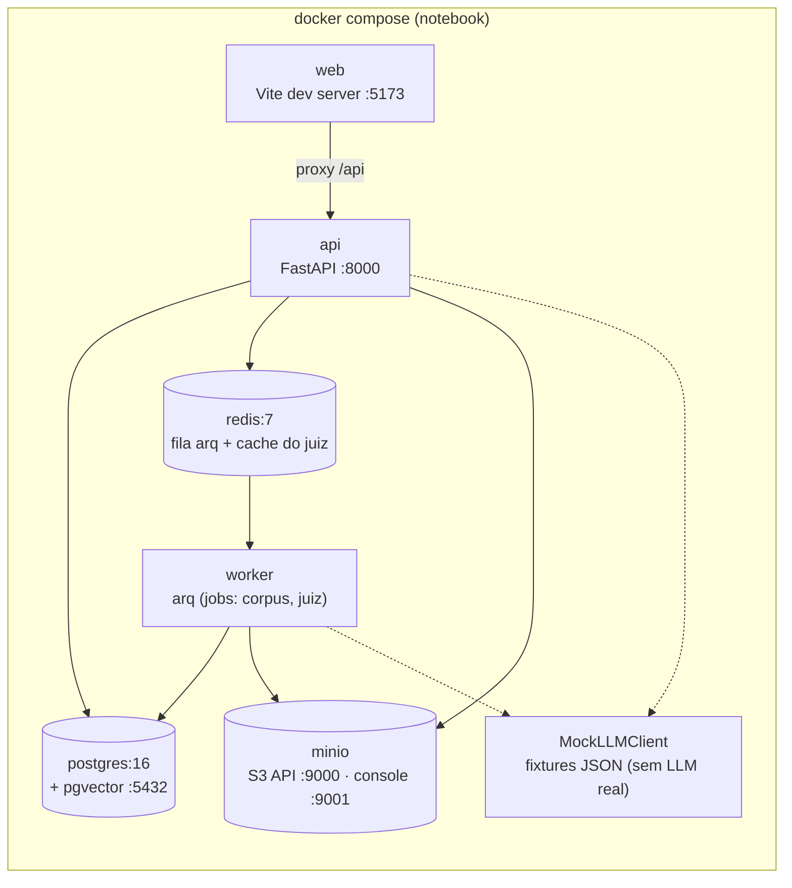

# AIrchitecture — MVP

Implementação do MVP do canvas de arquitetura com IA (specs completas em
`../../ADR/` e `../../Implementação/`).

**Decisões deste MVP:** 100% local e 100% mock — nenhuma chamada real de LLM.
Juiz, Arquiteto, bootstrap e tutorial respondem com **fixtures determinísticas**
nos mesmos schemas de produção (`LLM_PROVIDER=mock`). Providers reais
(Ollama/Iara) entram depois pela mesma interface `LLMClient`, sem tocar nas
features. O retrieval do corpus usa FTS do Postgres (pseudo-embeddings não têm
semântica); a coluna pgvector já existe para o provider real futuro.

## Arquitetura do MVP

Tudo sobe com **um `docker compose up`** — não há dependência externa alguma:



O par `api`/`worker` usa a **mesma imagem** com comandos distintos, espelhando a
topologia de produção (2 serviços ECS). MinIO implementa a API S3 — o mesmo
código boto3 roda na AWS trocando só o `endpoint_url`.

## Como executar

Pré-requisito: Docker Desktop rodando.

```bash
make up      # docker compose up -d --build (7 serviços)
make seed    # migrations (alembic upgrade head) + 21 arquétipos + usuário dev
open http://localhost:5173
```

Para indexar o corpus de guidelines de exemplo (publicado no MinIO pelo próprio
compose) e habilitar as citações do Juiz:

```bash
curl -X POST localhost:8000/api/corpus/publish \
  -H 'Content-Type: application/json' -d '{"version":"2026.07.14"}'
```

Serviços: web `:5173` · api `:8000` (`/docs` = OpenAPI) · MinIO console `:9001`
(login `blueprint` / `blueprint123`). Auth é stub por e-mail (`dev@local`,
admin) — recusada pelo app fora de `ENV=local`.

### Comandos do dia a dia

```bash
make logs                     # logs de api + worker
make test                     # pytest (host, via uv) + vitest (container)
make types                    # schemas Pydantic → tipos TS (contrato único)
make revision m="mensagem"    # nova migration autogenerate
make down                     # derruba a stack
```

Notas de dev:

- Código de `src/` recarrega a quente (uvicorn `--reload`; arq `--watch`), mas o
  watch do worker não recarrega módulos importados — mudou código de job, rode
  `docker compose restart worker`.
- Dependência Python nova (`uv add …`) exige rebuild: `docker compose build api worker`.
- Testes de API usam um banco `blueprint_test` isolado e pulam automaticamente
  se a stack estiver desligada.

## Fases

- [x] **Fase 0 — Fundação**: compose, FastAPI + Alembic, LLMClient mock, auth stub, web shell
- [x] **Fase 1 — Intake + diagramas + canvas** (US1)
- [x] **Fase 2 — Metadados, comentários, simulador** (US2/US3)
- [x] **Fase 3 — Corpus + busca** (M6)
- [x] **Fase 4 — Juiz único** (US5)
- [x] **Fase 4.5 — Passe de UX do playground** (referência: System Design Playground)
  - Controles de simulação saem do rail direito para uma **barra flutuante no topo
    do canvas**: botão Start, Speed, Traffic e slider Reads vs writes com rótulo
    interpretado ("92% read · Read-heavy · Hot read path")
  - Palette: **clique adiciona o componente ao canvas** (além do drag-and-drop)
  - Rails colapsáveis em abas verticais nas bordas (à direita: **AI Judges**,
    estilo da inspiração; à esquerda: contexto/problema)
- [x] **Fase 5 — Arquiteto ("Ask AI") + bootstrap** (US4)
  - Entrada do chat: **botão em balão de conversa no canto superior direito do
    canvas, título "Ask AI"** — abre o chat do Arquiteto com contexto completo
    (intake + canvas serializado + comentários + última simulação + RAG)
  - Ghost diff com Apply/Dismiss; bootstrap "Gerar esboço com IA" na criação
- [x] **Fase 6 — Export MD + tutorial** (US6/US8)
  - Export: botão "Exportar" na sessão → rascunho IA das seções editáveis
    (fixture `adr_draft`) → Jinja2 → `pre-adr.md` + `pre-adr.png` no MinIO
    (URLs assinadas); MD inclui requisitos, componentes, comentários,
    simulação e avaliação do Juiz com citações
  - Tutorial: Home → 🎓 Tutorial cria a sessão do encurtador de URL com dock
    de passos declarativos (`tutorial/steps.ts`); ações bloqueiam o Próximo
    observando os stores; pergunta sugerida enviada ao Ask AI com 1 clique
    (fixture específica por hash do prompt); progresso em localStorage

Decisões de produto que divergem das specs originais: intake opcional na criação
(obrigatório só para recursos de IA — gate 409); NFRs quantitativos vivem no
painel de simulação, não no intake; metadados de componente reduzidos a
nome + subtítulo (opcionais), com réplicas controladas por −/+ no próprio nó.
