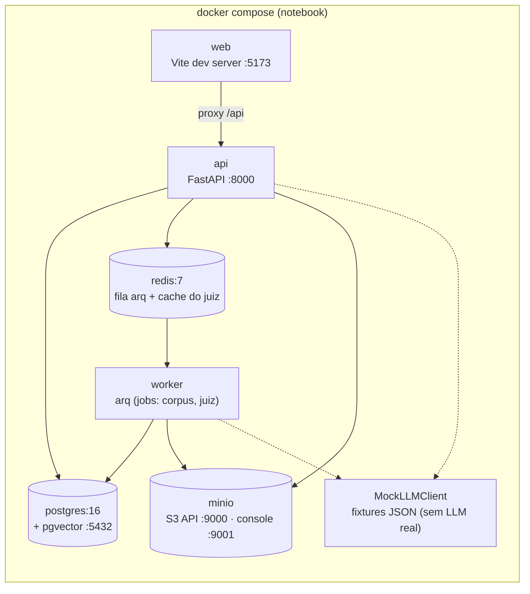

# AIrchitecture — MVP

App para criação de diagramas de System Design com simulador de carga e assistido por IA, para facilitar a vida de quem precisa desenvolver arquiteturas, simular cenários e preencher documentos de Arquitetura.

Este projeto surgiu da dor de desenvolver arquiteturas de software na cloud possuindo diversos gaps na minha formação e tento que aprender muitos conceitos enquanto desenvolvo. 
Para otimizar o meu tempo e entregar soluções melhores, comecei a criar as arquiteturas enquanto estudava usando IA, mas era um pouco moroso explicar cada conexão e nó no prompt ou fazer centenas de prints a cada nova mudança ou pergunta. Além disso os aplicativos comuns para criação de diagramas são muito ruins na minha opnião, poluidos, pesados e cheio de recursos desnecessários. Por isso decidi criar algo simples, que atenda as minhas necessidades de desenvolvimento e que integre IA nativamente.

O app propõe:

- Canvas para System Design
- Ask AIrchitect para tirar duvidas de arquitetura
- Judge-Architect - para avaliar a arquitetura criada utilizando os Guides pré-definidos
- Simulador Deterministico de carga - gargalos, latência, disponibilidade
- Pré-ADR para agilizar o processo e discussões

> Projeto completamente inspirado na ferramenta de estudo [System Design Playground](https://system-design-playground.replit.app) excelente, criado pelo [Lucas Montano](https://www.youtube.com/@LucasMontano)

**Decisões deste MVP:** 
- 100% local e 100% mock — nenhuma chamada real de LLM.
- Juiz, Arquiteto, bootstrap e tutorial respondem com **fixtures determinísticas**
- O retrieval do corpus usa FTS do Postgres (pseudo-embeddings não têm
semântica)

## Arquitetura do MVP

Tudo sobe com **um `docker compose up`** — não há dependência externa alguma:



O par `api`/`worker` usa a **mesma imagem** com comandos distintos, espelhando a
topologia de produção (2 serviços ECS). MinIO implementa a API S3 — o mesmo
código boto3 roda na AWS trocando só o `endpoint_url`.

## Como executar

Pré-requisito: Docker Desktop rodando.

```bash
make up      # docker compose up -d --build (7 serviços)
make seed    # migrations (alembic upgrade head) + 21 arquétipos + usuário dev
open http://localhost:5173
```

Para indexar o corpus de guidelines de exemplo (publicado no MinIO pelo próprio
compose) e habilitar as citações do Juiz:

```bash
curl -X POST localhost:8000/api/corpus/publish \
  -H 'Content-Type: application/json' -d '{"version":"2026.07.14"}'
```

Serviços: web `:5173` · api `:8000` (`/docs` = OpenAPI) · MinIO console `:9001`
(login `blueprint` / `blueprint123`). Auth é stub por e-mail (`dev@local`,
admin) — recusada pelo app fora de `ENV=local`.

### Comandos do dia a dia

```bash
make logs                     # logs de api + worker
make test                     # pytest (host, via uv) + vitest (container)
make types                    # schemas Pydantic → tipos TS (contrato único)
make revision m="mensagem"    # nova migration autogenerate
make down                     # derruba a stack
```

Notas de dev:

- Código de `src/` recarrega a quente (uvicorn `--reload`; arq `--watch`), mas o
  watch do worker não recarrega módulos importados — mudou código de job, rode
  `docker compose restart worker`.
- Dependência Python nova (`uv add …`) exige rebuild: `docker compose build api worker`.
- Testes de API usam um banco `blueprint_test` isolado e pulam automaticamente
  se a stack estiver desligada.
